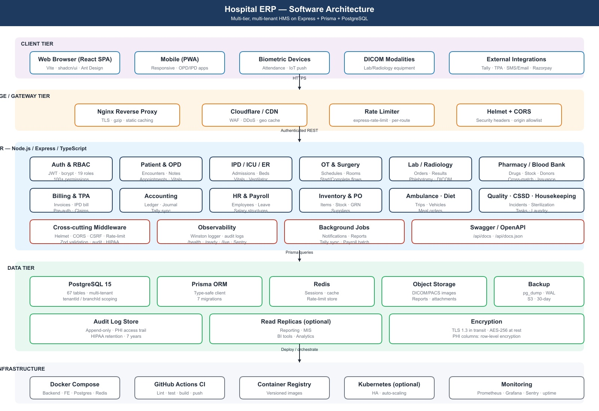
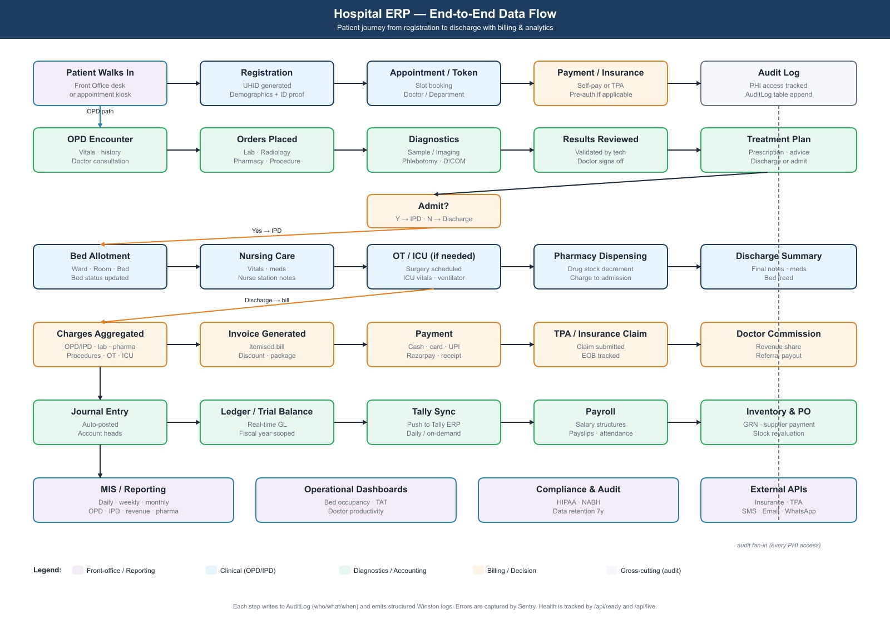

# Statement of Work — Hospital ERP

| Field | Value |
|---|---|
| **Project** | Hospital ERP (Hospital Management System) |
| **Repository** | `git@github.com:Tatu1984/hospital.git` |
| **Branch** | `develop` |
| **Document version** | 1.0 |
| **Date** | 2026-05-01 |
| **Owner** | Tatu1984 |
| **Audience** | Client stakeholders, engineering, compliance, finance |

---

## 1. Executive summary

The Hospital ERP is a multi-tenant, multi-branch, web-based hospital management system that digitises the entire patient journey — from front-office registration, through OPD/IPD/ER/ICU/OT clinical workflows, diagnostics (lab, radiology, phlebotomy, blood bank), pharmacy and inventory, to billing, TPA claims, double-entry accounting, HR, payroll, ambulance, housekeeping and analytics.

The system is delivered as a containerised stack (Postgres + Express + React + Redis + Nginx) with first-class RBAC across 19 roles and 100+ fine-grained permissions, structured audit logging, and a Swagger-documented REST API surface of **187 endpoints across 34 modules**.

---

## 2. Objectives

1. **Single source of clinical and financial truth** for the hospital — replace point solutions across OPD/IPD/lab/pharmacy/billing.
2. **Compliance posture** for HIPAA-style audit, NABH-aligned record-keeping, and Indian statutory requirements (GST, Tally export).
3. **Operational efficiency** — reduce front-office wait, eliminate paper notes for OPD/IPD, automate billing aggregation, real-time bed/ICU dashboards.
4. **Multi-branch consolidation** — one tenant, many branches, branch-scoped data with cross-branch reporting for owners.
5. **Doctor revenue & commission transparency** — contracts, accruals, payouts, referral commissions.
6. **Self-hostable** with optional cloud deployment.

---

## 3. Scope

### 3.1 In-scope modules (34)

| # | Module | Status |
|---|---|---|
| 1 | Patient registration & MRD | ✅ |
| 2 | Appointments & front-office | ✅ |
| 3 | OPD (encounter, vitals, notes, prescription) | ✅ |
| 4 | IPD (admission, bed, nursing, discharge) | ✅ |
| 5 | Emergency Room (triage → admit/discharge) | ✅ |
| 6 | ICU (beds, vitals, ventilator) | ✅ |
| 7 | Operation Theatre & Surgery | ✅ |
| 8 | Laboratory (orders, results, masters) | ✅ |
| 9 | Radiology (orders, reports, masters) | ✅ |
| 10 | Phlebotomy (collection workflow) | ✅ |
| 11 | Pharmacy (drugs, stock, dispensing) | ✅ |
| 12 | Blood Bank (donors, inventory, cross-match, issuance) | ✅ |
| 13 | Inventory & Purchase Orders | ✅ |
| 14 | Billing & Invoicing (OPD + IPD) | ✅ |
| 15 | TPA / Insurance (pre-auth, claims) | ✅ |
| 16 | Doctor Accounting & Commissions | ✅ |
| 17 | Accounting (GL, ledger, trial balance, Tally) | ✅ |
| 18 | HR & Payroll | ✅ |
| 19 | Biometric Attendance | ✅ |
| 20 | Ambulance fleet | ✅ |
| 21 | Housekeeping & Laundry | ✅ |
| 22 | Diet / Kitchen | ✅ |
| 23 | CSSD (sterilisation cycles) | ✅ |
| 24 | Quality & Incidents | ✅ |
| 25 | Health Checkup Packages | ✅ |
| 26 | Mortuary / Physiotherapy / MRD | 🟡 |
| 27 | DICOM / PACS | 🟦 |
| 28 | MIS & Analytics | ✅ |
| 29 | Master Data | ✅ |
| 30 | Auth & RBAC (19 roles) | ✅ |
| 31 | Audit & Security | ✅ |
| 32 | System Administration | ✅ |
| 33 | Multi-tenant / Multi-branch | ✅ |
| 34 | Notifications (SMS/Email) | 🟡 |

For a deep dive per module see [FEATURES.md](./FEATURES.md).

### 3.2 Native mobile apps (added 2026-05-05)

Two React Native applications, distributed via Apple App Store + Google Play, sharing the project's existing backend (`hospital-c3k5`) so there is one source of truth for patient data, auth, audit, RBAC and PHI compliance.

**Patient app** — for outpatients and admitted-patient family members.
- Onboarding (3-slide intro)
- Login (username/password initially; phone-OTP added in phase 2)
- Home dashboard — upcoming appointment, latest prescription, outstanding bill, active OT tracker if any
- Book appointment (speciality → doctor → slot)
- My appointments (upcoming + past, cancel/reschedule)
- Prescriptions (list + detail, "Order from pharmacy" CTA)
- Lab reports (list + PDF viewer, OS share)
- Bills (outstanding + history, Razorpay checkout)
- Family members (multi-profile switcher)
- Surgery tracker (the OT live-status feature)
- Profile + settings (logout, language, notifications)

**Doctor app** — for consultants and admitted-patient round physicians.
- Login (username/password + biometric unlock for repeat sessions)
- Today's schedule (OPD list, IPD rounds, scheduled surgeries)
- Patient detail (demographics, allergies, history, recent encounters)
- Encounter / OPD notes (SOAP template; voice-to-text in phase 2)
- Prescription writer (drug picker autocomplete from `/api/drugs`, Rx PDF)
- Lab / radiology orders (one-tap from a panel)
- IPD ward round (bed list → notes / orders)
- Vitals / ICU read-only chart
- OT stage updater (12-stage stepper for surgeons in-room)
- Schedule management (block hours, unavailable)
- Profile

**Mobile-specific backend extensions** (added under `/api/mobile/v1/*`):

| Endpoint | Purpose |
|---|---|
| `POST /api/mobile/v1/auth/login` | Mobile login (username/password) |
| `POST /api/mobile/v1/auth/request-otp` + `verify-otp` | Phase 2 — phone-only login |
| `GET /api/mobile/v1/patients/me` | Mobile-friendly aggregated home payload |
| `POST /api/mobile/v1/devices` | Register FCM/APNS token for push |
| `POST /api/mobile/v1/notifications/push` | Server-to-device push (appt reminders, lab results, OT updates) |
| `GET /api/mobile/v1/files/:id` | Pre-signed URL for PDFs (lab/Rx) — depends on S3 |

The mobile-specific code follows a layered architecture under `backend/src/modules/<domain>/` (controller / service / repository / routes / model) and reuses the same Prisma client, auth middleware, RBAC, audit log writer, and rate limiters as the desktop portal.

**Mobile tech stack:**
- Expo SDK 52 (Managed) + Expo Router (file-based)
- NativeWind v4 (Tailwind for React Native)
- react-native-reusables (shadcn-style component library for RN)
- Moti + react-native-reanimated (animations)
- expo-secure-store (token storage), expo-local-authentication (biometric)
- EAS Build for both stores from one config

**Mobile-app deliverables:**
- Source: `mobile/patient/` and `mobile/doctor/` in the same repo
- Both apps published to TestFlight + Google Play Internal Testing
- Push notifications via FCM (Android) + APNS (iOS)
- Deep-link domain (e.g. `app.{client-domain}.com`) for SMS-link tracker
- App Store / Play Store metadata + screenshots

**Mobile-app timeline (from kickoff):**
| Week | Milestone |
|---|---|
| 1 | Backend `modules/` skeleton, mobile auth, push wiring |
| 2–3 | Patient app — 5 core screens (login, home, book, my-appointments, profile) |
| 3–4 | Doctor app — 5 core screens (login, today, patient detail, Rx writer, OT stage updater) |
| 5 | Patient app — remaining screens (Rx, lab, bills, family switcher, tracker) |
| 6 | Doctor app — remaining screens (IPD round, vitals, schedule mgmt) |
| 7 | EAS Build, store metadata, internal testing |
| 8 | UAT + store review submission |

### 3.3 Out of scope (this engagement)

- Custom report builder (drag-drop) — phase 2
- AI clinical decision support
- Voice transcription / dictation
- Wearable / IoT continuous-monitoring integration beyond ICU manual entry
- Phone-OTP login (phase 2 — depends on DLT-registered SMS sender)

---

## 4. Deliverables

| # | Deliverable | Format | Status |
|---|---|---|---|
| 1 | Source code on `develop` branch | Git repo | ✅ |
| 2 | This SoW | `.md`, `.docx` | ✅ |
| 3 | Feature list | `.md`, `.docx` | ✅ |
| 4 | Developer guide (DB schema + APIs + routers) | `.md`, `.docx` | ✅ |
| 5 | Software architecture diagram | `.jpg` | ✅ |
| 6 | Data flow diagram | `.jpg` | ✅ |
| 7 | Postman / Swagger collection | OpenAPI JSON at `/api/docs.json` | ✅ |
| 8 | Docker Compose + Nginx config | Repo | ✅ |
| 9 | CI/CD pipeline | `.github/workflows/*.yml` | ✅ |
| 10 | Seed data with sample tenant + roles | `prisma/seed.ts` | ✅ |
| 11 | Migration scripts | `prisma/migrations/*` | ✅ |
| 12 | Test suite (RBAC + validators) | `backend/src/__tests__/` | ✅ |
| 13 | `.env.example` for backend | Repo root + backend | ✅ (post-fix) |
| 14 | Operational runbook (startup, backup, secrets rotation) | `.md` | 🟡 |
| 15 | Patient mobile app source (React Native, Expo) | `mobile/patient/` | 🟡 in progress |
| 16 | Doctor mobile app source (React Native, Expo) | `mobile/doctor/` | 🟡 in progress |
| 17 | Mobile-app screen designs (figma-ready stack: Expo + NativeWind + react-native-reusables) | UI specs | 🟡 in progress |
| 18 | Both apps on TestFlight + Play Internal Testing | EAS submission | ⏸ pending Apple/Google accounts + branding |

---

## 5. Architecture

### 5.1 Tiers

| Tier | Components |
|---|---|
| **Client** | React 18 SPA (Vite), Ant Design + shadcn/ui, jsPDF for printing, recharts for analytics |
| **Edge** | Nginx (TLS, gzip, static cache, security headers); optional Cloudflare WAF/CDN |
| **Application** | Node.js 20 + Express + TypeScript; modular controllers; cross-cutting middleware (helmet, CORS, CSRF, rate-limit, Zod, HIPAA, audit) |
| **Data** | PostgreSQL 15 (67 tables, Prisma ORM); Redis (sessions, cache, rate-limit store); object storage for DICOM/reports/attachments; pg backups (pg_dump + WAL) |
| **Observability** | Winston structured logs; Sentry; `/health`, `/api/live`, `/api/ready`, `/api/health/detailed`; Prometheus / Grafana optional |
| **Infrastructure** | Docker Compose for dev/single-node; Kubernetes optional; GitHub Actions CI/CD |

### 5.2 Tech stack (precise versions)

**Backend (`backend/package.json`)**
- Node.js 20 · TypeScript 5.3 · Express 4.18
- Prisma 5.7 + PostgreSQL 15
- `bcryptjs`, `jsonwebtoken` (JWT auth)
- `helmet`, `express-rate-limit`, `cors`, `compression`, `morgan`
- `zod` (validation)
- `winston` (logging) · `@sentry/node`
- `swagger-jsdoc` + `swagger-ui-express`
- `vitest` + `supertest` (testing)

**Frontend (`frontend/package.json`)**
- React 18 + Vite 5 + TypeScript 5.3
- Ant Design 5 + shadcn/ui (Radix primitives) + Tailwind CSS 4
- `react-router-dom` 6
- `axios` (API client)
- `recharts` (charts), `jspdf` + `jspdf-autotable` (PDF export)
- `date-fns`, `dayjs`
- `@react-google-maps/api` (ambulance/geo)

**Infra**
- Docker · Docker Compose · Nginx · Redis 7
- GitHub Actions (Postgres 15 service for tests)

### 5.3 Data flow

Patient walks in → registration creates `Patient` → appointment & token → check-in opens `Encounter` → OPD/IPD/ER/ICU paths produce `Order` (lab/radiology/pharmacy/procedure) → results / dispensing aggregate as `InvoiceItem` against the encounter or admission → invoice + payment → journal entries posted to GL → optional Tally sync → reports & MIS read the same DB. Every PHI-touching read or mutation appends to `AuditLog`.

---

## 6. Non-functional requirements

| Category | Target |
|---|---|
| **Performance** | p95 API < 500ms for read endpoints under 100 RPS; list endpoints paginated (default 20, max 200) |
| **Availability** | 99.5% (single-node) / 99.9% (HA optional); container healthchecks + auto-restart |
| **Security** | OWASP top-10 mitigations; JWT (15-min access, 7-day refresh — phase 2); bcrypt cost 10; TLS 1.3 only; CSP + HSTS via Nginx; rate limit 5 attempts/15min on `/auth/login` |
| **Data protection** | TLS in transit; at-rest encryption via Postgres + disk; PHI-column encryption (phase 2); 7-year audit retention |
| **Compliance** | HIPAA-style audit; NABH record-keeping alignment; GST-compliant invoices |
| **Backups** | Nightly `pg_dump`; WAL archiving; 30-day retention; quarterly restore drill |
| **Browsers** | Latest 2 versions of Chrome / Edge / Safari; Firefox best-effort |
| **Accessibility** | WCAG 2.1 AA target |
| **Localisation** | English baseline; Hindi / regional roadmap |
| **Scale** | 100 concurrent users / branch; 50k patients / 5M rows on baseline 4 vCPU / 16 GB / 200 GB SSD |

---

## 7. Security & compliance

- **Authentication:** JWT with `bcryptjs` password hashing.
- **Authorisation:** Role + Permission RBAC (`backend/src/rbac.ts`) — 19 roles × 100+ permissions enforced via `requireRole(...)` and `requirePermission(...)` on every API route.
- **Audit:** Append-only `AuditLog` for PHI access, security events (`LOGIN_SUCCESS`, `LOGIN_FAILED`), and sensitive mutations.
- **Validation:** Zod schemas at the API boundary on all create/update endpoints.
- **Headers:** Helmet (CSP, X-Frame-Options, X-Content-Type-Options, Referrer-Policy) + Nginx hardening.
- **Rate-limit:** `authRateLimiter` on `/auth/login` (5/15min) and `generalRateLimiter` on `/api/*` (100/15min).
- **Secrets:** `.env` only; no defaults baked into `docker-compose.yml`. Production uses Docker secrets / Kubernetes secrets.
- **Tenant isolation:** `tenantId` + `branchId` on every table; runtime middleware attaches scope from JWT.

---

## 8. Milestones & timeline

| Phase | Scope | Status |
|---|---|---|
| **M0 — Foundation** | Repo, schema, auth, RBAC, CI | ✅ |
| **M1 — Core clinical** | Patient, Appointment, OPD, IPD, Lab, Pharmacy, Billing | ✅ |
| **M2 — Specialty modules** | ER, ICU, OT, Blood Bank, Radiology, Phlebotomy | ✅ |
| **M3 — Operations** | HR, Payroll, Inventory/PO, Ambulance, Housekeeping, Diet, CSSD | ✅ |
| **M4 — Finance** | TPA, Doctor accounting, Commissions, GL/Tally | ✅ |
| **M5 — Production hardening** | RBAC enforcement on every route, full Zod coverage, secrets cleanup, frontend state mgmt + token refresh, CI test gate | ✅ (this engagement) |
| **M6 — Phase 2** | DICOM/PACS, patient portal, native mobile, custom reports, MFA/SSO | 🟦 |

---

## 9. Acceptance criteria (M5 — production hardening)

The engagement is complete when:

1. ✅ All 187 API routes carry an explicit `requireRole`/`requirePermission` guard (no authenticated-only endpoint outside `/auth/login` and `/health/*`).
2. ✅ All POST/PUT routes outside trivial endpoints carry a `validateBody(...)` Zod schema.
3. ✅ No secret values (JWT, DB password, default user password) appear as defaults in `docker-compose.yml`, `seed.ts`, or any committed file. `.env.example` documents every required variable.
4. ✅ `npm test` runs in CI on every push and PR; failing tests block merge.
5. ✅ Frontend uses a typed API client with token refresh + global auth context; all 39 pages share a single auth store.
6. ✅ Both `.md` and `.docx` documents (this SoW, FEATURES, DEVELOPER_GUIDE) are committed under `docs/sow/`.
7. ✅ Architecture and data-flow `.jpg` diagrams render in `.md` and embed in `.docx`.

---

## 10. Risks & mitigations

| Risk | Mitigation |
|---|---|
| RBAC drift as new endpoints land | Lint rule / route registry checked in CI; reviewer template |
| Schema migration on hot data | Use `prisma migrate deploy` only; pre-flight on staging; reversible migrations |
| PHI leakage via logs | Winston redaction filter; no patient identifiers in logs (only IDs) |
| Single-node failure | Healthcheck + restart; HA cutover via Kubernetes (phase 2) |
| Tally export drift | Idempotent sync with run-ids; reconciliation report |
| Performance under load | DB indexes audited per release; pagination enforced; Redis for hot reads |

---

## 11. Assumptions

- Customer provides domain, TLS certs, SMTP and SMS gateway credentials.
- Customer's IT can run Docker (or supplies a Linux VM with 4 vCPU / 16 GB / 200 GB).
- DICOM/PACS integration in phase 2 will use a shipped Orthanc or Dicoogle instance.
- Tally Prime is on the same LAN as the ERP host or accessible via VPN.
- All clinical staff have unique user accounts (no shared logins).

---

## 12. Roles & responsibilities

| Role | Responsibility |
|---|---|
| **Vendor (Engineering)** | Build, test, deploy, operate; code reviews; weekly release |
| **Customer (Hospital admin)** | UAT sign-off, master data seeding, user provisioning, training rollout |
| **Customer (Clinical)** | OPD/IPD workflow validation, prescription templates, NABH alignment |
| **Customer (Finance)** | GST setup, fiscal year config, Tally credentials, invoice templates |
| **Customer (IT/Infra)** | Server provisioning, backups, network, biometric device install |

---

## 13. Change control

Any change to scope, deliverables, or acceptance criteria is captured in a written change request, sized in story points, and approved by the customer sponsor before implementation. Hot fixes for live-site issues are exempt and tracked separately.

---

## 14. References

- [FEATURES.md](./FEATURES.md) — full feature catalogue
- [DEVELOPER_GUIDE.md](./DEVELOPER_GUIDE.md) — DB schema, API surface, frontend route map
- `backend/prisma/schema.prisma` — 67-model data model
- `backend/src/server.ts` — 187-endpoint API surface
- `backend/src/rbac.ts` — role/permission catalogue
- `/api/docs` — live Swagger UI
- `/api/docs.json` — OpenAPI spec
